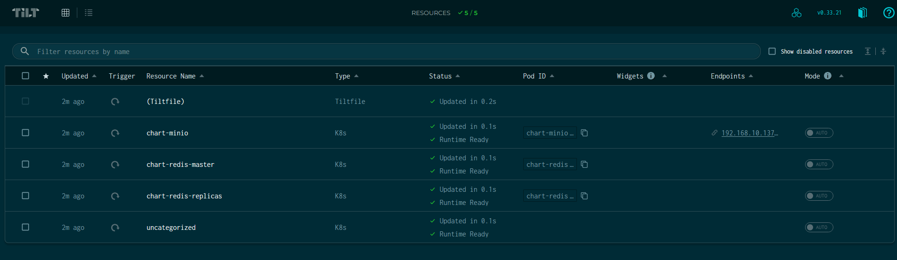
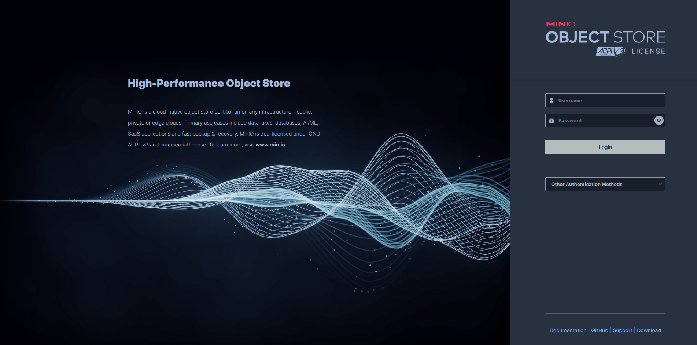

# auto-catan
Academic technical demonstration of agentic RL implementation of game AI playing `Catan`. It is aimed to showcase a prototype pipeline starting from data acquisition, model training, and model inference

## Table of Content
1. [Installation](#install)
    - [Install and Start Cluster](#cluster-start)
    - [Install Application Helm Chart](#app-helm)
    - [Health Check](#health)

2. [Installation Troubleshooting](#bugs)
3. [Dev Dependencies](#deps)

## <a name="install"></a> Installation

> *NOTE: Currently, the installation of the cluster using defined IAC only supports Linux (Tested on Ubuntu 24.04 Server). YES YOU WILL NEED ROOT ACCESS TO YOUR MACHINE* 

### <a name="cluster-start"></a> Install and Start Cluster

1. Create Local Executable Directory

```bash
$ mkdir -p $HOME/.local/bin
```

2. Add the above directory to path

```bash
$ echo "export PATH=$PATH:$HOME/.local/bin" >> $HOME/.bashrc
$ source $HOME/.bashrc
```
3. Run the scripts in `iac` to bootstrap cluster

```bash
$ ./1-install-kubectl.sh
$ ./2-install-k3s.sh
...
...
```

4. Refresh your terminal to realize system changes

```bash
$ source $HOME/.bashrc
```

5. Check status of Cluster: *Cluster status should be active*

```bash
$ sudo systemctl status k3s
```

The more comprehensive way of checking if the cluster is healthy is to check deployment and pod status under the `kube-system` namespace. For K3s, `coredns`, `local-path-provisioner`, `metrics-server`, and `traefik` should be all running and ready.

```bash
$ kubectl get all -A
```
We want to see the **non-installer** pods to be `Running` and `Ready`. The **installer** pods should not be running, and should be shown as `Completed`.

### <a name="app-helm"></a> Install Application Helm Chart

1. Once the cluster is running and cluster health can be verified, we can start deploying our application. Start by changing directories to root of the project and executing the following commands

```bash
$ helm repo add bitnami https://charts.bitnami.com/bitnami
$ helm repo add kedacore https://kedacore.github.io/charts
$ helm dependency build ./deploy
```

This will install our custom helm chart that contain RL specific applications and its dependencies.

2. Once the helm dependencies are installed you can bring up the deployment using `tilt`

```bash
$ tilt up --host 0.0.0.0
```  
3. You can check if the deployment is properly working by looking at the `Tilt` status and navigating to `Minio`



> *Tilt showing all deployments are operational*



> *Splash Screen for Minio*

## <a name="bugs"></a>Installation Troubleshooting

1. CoreDNS `CrashBackOffLoop`

If you are running into pods in `coredns` experiencing `CrashBackOffLoop` due to the control plane not being able to `curl` the health probe, it is most likely because you do not have a DNS server configured with your host machine in `/etc/resolv.conf` 

Execute the following command:

```bash
$ kubectl edit configmap coredns -n kube-system
```

Remove the following field and its assocaited predicates (if there are any)

```bash
 forward . /etc/resolv.conf
```

Add the following in its place

```bash
forward . 8.8.8.8 8.8.4.4
```

After the edit is complete, restart the `coredns` deployment

```bash
$ kubectl rollout restart deployment.apps/coredns -n kube-system
$ kubectl rollout restart deployment.apps/traefik -n kube-system
$ kubectl rollout restart deployment.apps/metrics-server -n kube-system
``` 
2. Docker Failing to Build Images (`deb.debian.org` not found):

If you are developing `Dockerfiles` that do not have an image already built, and you are in an Ubuntu VM, and chose to install `docker` from the OS installation menu, there is a good chance `docker` was installed using `snap`.

If `docker` is having a hard time resolving QDN's you will have to manually add google's DNS server to the docker config in the following location

```bash
/var/snap/docker/current/config
```
Edit the file `daemon.json` (note: you will have to be sudo to run this) and add the following lines:

```json
{
    "dns": ["8.8.8.8", "8.8.4.4"]
}
```

This should now allow docker to properly build docker files when before it might have been having issues resolving hosts.

## <a name="deps"></a> Dev Dependencies
In order to assist in reducing reproducability issues, a list of the following dependencies used to develop the project is provided:

- [Ubuntu Server 24.04](https://ubuntu.com/download/server) *(Kernel: 6.8.0-45-generic)* 
- [Docker](https://www.docker.com/) *(Version 24.0.5, Build ced0996)*
- [Helm](https://helm.sh/docs/intro/install/)
- [Bash](https://www.gnu.org/software/bash/) *(Used in IaC scripting)*
- [Tilt](https://tilt.dev/)

### Some Comments Regarding the Repo
- If you use this, and you are experiencing issues, you are largerly on your own. If you email me I can possibly try to help out (islamwasif3@gmail.com)
- Yes, the steps to get it up is bad/redundant/buggy. I apologize as the project was made in a pinch with some classmates
